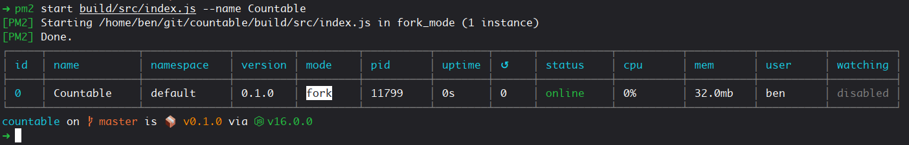

# Self-hosting

I'd recommend adding the official bot to the server to ensure you get the latest updates more easily and, eventually, are able to compete against other servers using the same bot.

If you _really_ want to host your own version, however, read on to find out how!

### 1. Clone the repository

```bash
git clone https://github.com/benslv/countable.git
```

### 2. Move into the newly-created directory

```bash
cd countable
```

### 3. Install the bot's dependencies

```bash
yarn install
```

### 4. Create a config file

Create a file called `config.json` in the root of the project directory. Place the `CLIENT_ID` and `CLIENT_TOKEN` from your own bot application into it like so:

```javascript
{
  "CLIENT_ID": "ID goes here",
  "CLIENT_TOKEN": "token goes here"
}
```


Follow this [guide](https://discordjs.guide/preparations/setting-up-a-bot-application.html) for instructions on how to create your own bot application.


### 5. Add your bot to a server

Use this [guide](https://discordjs.guide/preparations/adding-your-bot-to-servers.html) to add your bot to a server of your choice. Once done, you can test whether the bot works correctly with the following command.

```bash
yarn start
```

If everything is working correctly, you should see the bot appear as online in the sidebar of your server!

### 6. \(optional\) Host the bot permanently

You'll probably notice that closing the terminal window stops the bot from responding to any messages. Not exactly ideal...

For the official bot I use a package called [PM2](https://pm2.keymetrics.io/) to manage the process and make sure it doesn't randomly crash and stop working.

Once installed, just navigate into the `countable` directory and enter the following commands to get it up and running:

```bash
# Build the application
yarn build

# Start the process (and give it a nice name)
pm2 start build/src/index.js --name Countable
```

Once that's all done, you can go ahead and close the terminal window and your bot should continue to run like normal.



